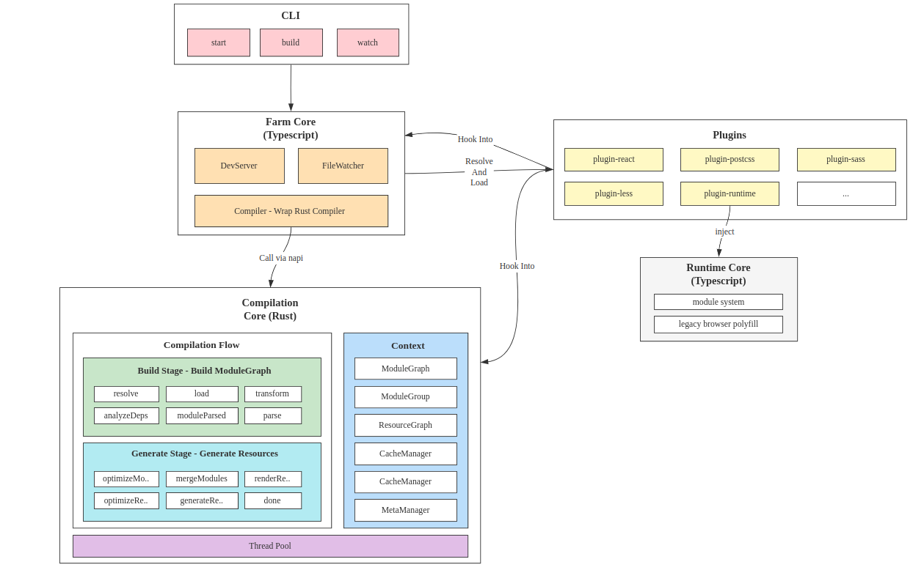
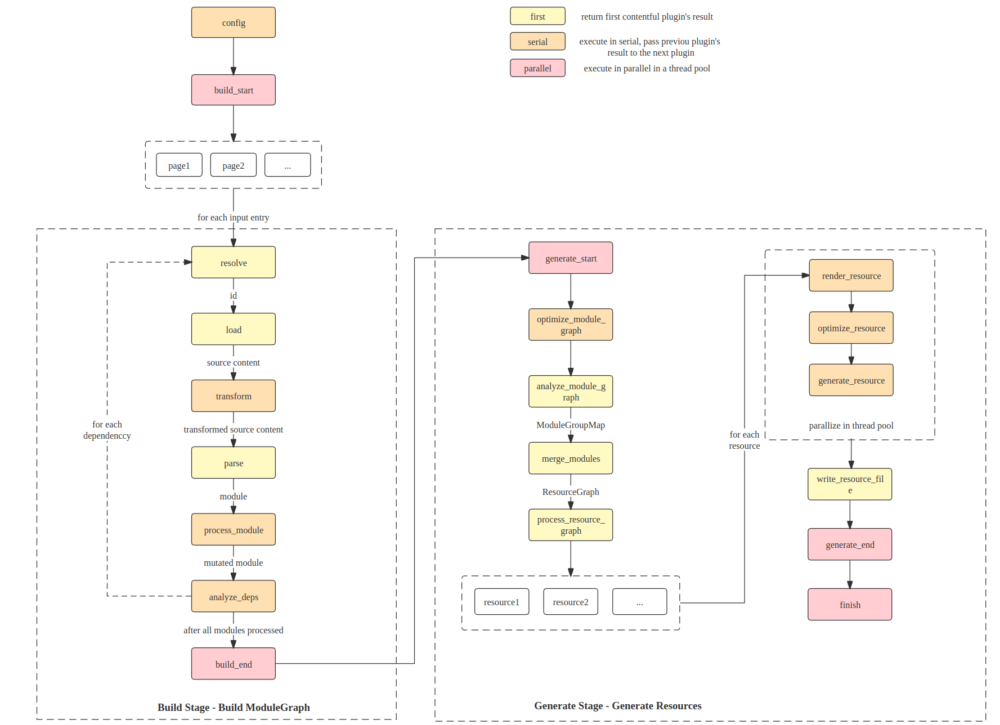

- Name: Farm Core Architecture Design
- Start Date: 2022-07-18
- RFC PR: [farm-fe/rfcs#3](https://github.com/farm-fe/rfcs/pull/3)

# Summary
This RFC designs the implementation of a super-fast web compiler using Typescript and Rust. The newly designed compiler should inherit all the advantages of existing tools like webpack and vite while avoiding their disadvantages and being significantly faster.

# Motivation
As web projects scale, build performance becomes a major bottleneck. A web project compilation using webpack may take 10 minutes or more, and a hot module replacement (HMR) update may take 10 seconds or more, significantly reducing efficiency.

Tools like vite have emerged to address this issue, but vite uses native ESM and unbundled development mode, which leads to a large number of module requests becoming the new bottleneck. This can cause the network panel to crash when there are thousands of module requests.

Vite is fast because it uses esbuild, which is written in Go and takes advantage of native performance. However, ESM is not available for legacy browsers, and esbuild is not yet stable enough for production use. As a result, vite uses Rollup as a bundler in production to address compatibility and stabilization issues. This introduces new problems, such as significant differences in behavior between development and production environments, and slower performance compared to esbuild due to Rollup being written in Typescript.

We can take advantage of both webpack and vite while avoiding their disadvantages. Webpack is slow, but we can use a system-level language (Rust) to significantly improve build performance. Vite is unbundled, which means caching can be more granular than webpack, but it has problems like inconsistency (between development and production) and a large number of requests (which may slow down resource loading or even crash the browser). We can use a partial bundling strategy to reduce the number of requests without losing cache granularity.

As discussed above, Farm is a web building tool aimed at being faster (both in terms of build performance and resource loading performance) and more consistent, taking advantage of existing tools and discarding their disadvantages. The Farm team will initially focus on web project compilation, which means our inputs will primarily be web assets such as HTML, JS/JSX/TS/TSX, CSS/SCSS/LESS, PNG/SVG, and so on. Every design decision we make will prioritize browser compatibility. Although a universal bundler (bundling everything together and outputting various formats) is not our primary goal at the moment, you can achieve whatever you want through plugins.

Our goal is to design a truly modern web compiler that is super fast, stable, consistent, compatible, and prioritizes modern web technologies. We want to create a next-generation building tool that genuinely meets the needs of developers.

> Note: This RFC mainly covers the architecture; the details of each part will be split into separate RFCs.

# Reference-level explanation
This section covers the technical design details of Farm.

## 1. Design Philosophy
* **Performance first**: Everything will be written in Rust as long as we can, with only a few parts that are not performance bottlenecks being written in JS.
* **Rollup-style plugin system**: Easy to create your own plugins and easy to migrate your plugins/projects from Rollup/Vite/Webpack.
* **First-class citizen support for all web assets**: We won't need to transform everything into JavaScript anymore; we treat anything as a first-class citizen. In the Farm core, basic assets like `html`, `js/jsx/ts/tsx`, `css/scss`, `png/svg/...` will be supported by default, and you can use plugins to support more assets.
* **Browser first**: Farm's production aims to run in the browser/nodejs (only for SSR); we won't be a universal bundler and will focus on improving web performance and efficiency.
* **Unbundled first**: We will only partially bundle modules together when the module numbers or size reach our limits. When partially bundling modules, we will use a powerful partial bundling strategy to control resource request numbers without losing cache granularity.
* **Consistency first**: We will ensure that development and production environments are exactly the same by default. What you see in development will be the same as what you get in production.
* **Compatibility**: Farm will work with both legacy and modern browsers.

## 2. Terms
The definition of terms Farm used:
* **Module**: Basic compilation unit, which may be a file or a virtual module. Examples include all kinds of web assets like `js, ts, jsx, tsx, css, scss, png, svg...`, or virtual modules implemented by plugins.
* **Resource**: A `Resource` represents a `js/css/html/png/svg/map/..` file and may contain many original modules.
* **ResourcePot**: A `ResourcePot` may generate one or many `Resource`s. The `ResourcePot` comes from many partially bundled `Module`s, for example, many `js` modules bundled to one `ResourcePot`, and one `ResourcePot` generates a `.js` file and a `.js.map` file.
* **ModuleGroup**: All statically imported modules from an entry will be in the same `ModuleGroup`.
* **ModuleGraph**: Dependency graph of all resolved modules.
* **ResourcePotGraph**: Dependency graph of the `ResourcePot`.
* **ModulePot**: A `ModulePot` is a group of modules that will always be together, which means the modules in the same `ModulePot` will always be in the same `ResourcePot`.

## 3. Architecture
Farm core consists of two parts:
* Typescript is responsible for handling config/plugins, DevServer, and FileWatcher (for HMR).
* Rust core is responsible for the compilation details, including module resolving/loading/parsing and resource optimizing/generating.

See the detailed graph below:



The details of each part will be designed in the following sections.

## 4. Compilation Context
Compilation Context contains all shared info across the compilation. This section covers the details of CompilationContext.

CompilationContext can be accessed in the plugins through hook params:
```rust
struct MyPlugin {}

impl Plugin for MyPlugin {
  fn name(&self) -> String {
    String::from("MyPlugin")
  }
  // access CompilationContext via parameter
  fn resolve(&self, param: &PluginResolveHookParam, context: &Arc<CompilationContext>) -> Result<Option<PluginResolveHookResult>> {
    // ..
  }
}
```

The definition of `CompilationContext` is:
```rust
/// Shared context throughout the whole compilation.
pub struct CompilationContext {
  pub config: Config,
  pub module_graph: RwLock<ModuleGraph>,
  pub module_group_map: ModuleGroupMap,
  pub plugin_driver: PluginDriver,
  pub resource_graph: ResourceGraph,
  pub cache_manager: CacheManager,
  pub meta: ContextMetaData,
}
```
`meta` is shared data throughout the compilation, for example, SourceMap of Swc. Plugins can also add custom data and insert it into `meta.custom`.

Other data structures like `module_graph` or `resource_graph` are constructed during the compilation lifecycle of the Farm core.

The details of each field of `CompilationContext` will be introduced in separate RFCs. For example, `ModuleGraph` and `ModuleGroupMap` are related to the `partial bundling algorithm`, and `CacheManager` is related to the `cache system`.

## 5. Compilation Flow And Plugin Hooks
We divide the compilation flow into two stages (borrowed from Rollup) - Build Stage and Generate Stage. The compilation flow is all about hooks. See the graph below for details:



There are three kinds of hooks (the same as Rollup):
* `first`: The hooks execute in serial and return immediately when a hook returns a `non-null` value. (The `null` means `null` and undefined in JS, `None` in Rust).
* `serial`: The hooks execute in serial, and every hook's result will pass to the next hook, using the last hook's result as the final result.
* `parallel`: The hooks execute in parallel in a thread pool and should be isolated.

### 5.1 Build Stage
The goal of the `Build Stage` is to build a `ModuleGraph`.

Starting from the user-configured compilation entry, resolving, loading, transforming, and parsing the entry module, then analyze its dependencies and do the same operation for the dependencies again until all related modules are handled.

Each module's building flow is as follows.
`
./index.html -> resolve -> load -> transform -> parse -> moduleParsed -> analyzeDeps ----> resolve deps recursively
`

Each module will build in a separate thread in a thread pool, and after `analyzeDeps`, we return to resolve again for each dependency.

#### 5.1.1 Resolve
The resolve hook is in charge of resolving a module, returning its ID and related properties. See the hook definition, parameter, and result below:

* **`Hook Kind`**: `first`

```rust
fn resolve(
  &self,
  _param: &PluginResolveHookParam,
  _context: &Arc<CompilationContext>,
  _hook_context: &PluginHookContext,
) -> Result<Option<PluginResolveHookResult>> {
  // ...
}

/// Parameter of the resolve hook
#[derive(Debug, Clone, Serialize, Deserialize)]
#[serde(rename = "camelCase")]
pub struct PluginResolveHookParam {
  /// the source would like to resolve, for example, './index'
  pub source: String,
  /// the start location to resolve `specifier`, being [None] if resolving an entry or resolving an HMR update.
  pub importer: Option<ModuleId>,
  /// for example, [ResolveKind::Import] for static import (`import a from './a'`)
  pub kind: ResolveKind,
}

#[derive(Debug, Default, Serialize, Deserialize)]
#[serde(rename = "camelCase", default)]
pub struct PluginResolveHookResult {
  /// resolved path, normally a resolved path.
  pub resolved_path: String,
  /// whether this module should be external, if true, the module won't be present in the final result
  pub external: bool,
  /// whether this module has side effects, affects tree shaking
  pub side_effects: bool,
  /// the query parsed from specifier, for example, query should be `{ inline: true }` if specifier is `./a.png?inline`
  /// if you have custom plugins, your plugin should be responsible for parsing the query
  /// if you just want a normal query parsing like the example above, [farmfe_toolkit::resolve::parse_query] should be helpful
  pub query: HashMap<String, String>,
}
```

#### 5.1.2 Load
Loading the module's content based on `id`, return **String** based content. If loading binary content like images, it should be encoded to String first (usually base64). We force the use of String because of the serialization, the value should be easy to pass to the JS plugins and Rust plugin, so we force it to be serializable.

* **`Hook Kind`**: `first`

```rust
fn load(
  &self,
  _param: &PluginLoadHookParam,
  _context: &Arc<CompilationContext>,
  _hook_context: &PluginHookContext,
) -> Result<Option<PluginLoadHookResult>> {
  // ..
}

#[derive(Debug, Clone, Serialize, Deserialize)]
#[serde(rename = "camelCase")]
pub struct PluginLoadHookParam<'a> {
  /// the resolved path from resolve hook
  pub resolved_path: &'a str,
  /// the query map
  pub query: HashMap<String, String>,
}

#[derive(Debug, Serialize, Deserialize)]
#[serde(rename = "camelCase")]
pub struct PluginLoadHookResult {
  /// the source content of the module
  pub content: String,
  /// the type of the module, for example [ModuleType::Js] stands for a normal JavaScript file,
  /// usually ending with `.js` extension
  pub module_type: ModuleType,
}
```

#### 5.1.3 Transform
Transforming the module's content based on `loaded source content`, the transforming is String in and String out. If you want to share Farm's internal AST, you can use `SWC plugins`.
 
* **`Hook Kind`**: `serial`

```rust
fn transform(
  &self,
  _param: &PluginTransformHookParam,
  _context: &Arc<CompilationContext>,
) -> Result<Option<PluginTransformHookResult>> {
  // ..
}

#[derive(Debug, Clone, Serialize, Deserialize)]
#[serde(rename = "camelCase")]
pub struct PluginTransformHookParam<'a> {
  /// source content after load or transformed result of the previous plugin
  pub content: String,
  /// module type after load
  pub module_type: ModuleType,
  /// resolved path from resolve hook
  pub resolved_path: &'a str,
  /// query from resolve hook
  pub query: HashMap<String, String>,
}

#[derive(Debug, Default, Serialize, Deserialize)]
#[serde(rename = "camelCase", default)]
pub struct PluginTransformHookResult {
  /// transformed source content, will be passed to the next plugin.
  pub content: String,
  /// you can change the module type after transform.
  pub module_type: Option<ModuleType>,
  /// transformed source map, all plugins' transformed source map will be stored as a source map chain.
  pub source_map: Option<String>,
}
```

#### 5.1.4 Parse
Parsing the module's content into an internal `Module` instance, converting source code to an AST, and so on.

* **`Hook Kind`**: `first`

```rust
fn parse(
  &self,
  _param: &PluginParseHookParam,
  _context: &Arc<CompilationContext>,
  _hook_context: &PluginHookContext,
) -> Result<Option<ModuleMetaData>> {
  // ..
}

#[derive(Debug)]
pub struct PluginParseHookParam {
  /// module id
  pub module_id: ModuleId,
  /// resolved path
  pub resolved_path: String,
  /// resolved query
  pub query: HashMap<String, String>,
  pub module_type: ModuleType,
  /// source content(after transform)
  pub content: String,
}
```

#### 5.1.5 Process Module
Process and transform the module, potentially changing any property of the module, for example, transforming the parsed AST (using the SWC transformer and SWC plugins).

* **`Hook Kind`**: `serial`
```rust
fn process_module(
  &self,
  _module: &mut PluginProcessModuleHookParam,
  _context: &Arc<CompilationContext>,
) -> Result<Option<()>> {
  // ..
}

pub struct PluginProcessModuleHookParam<'a> {
  pub module_id: &'a ModuleId,
  pub module_type: &'a ModuleType,
  pub meta: &'a mut ModuleMetaData,
}
```

#### 5.1.6 Analyze Deps
Analyze the dependencies of each module. For example, for `import a from './a'`, the result should be `{ specifier: './a', kind: ResolveKind::Import }`

* **`Hook Kind`**: `serial`
```rust
fn analyze_deps(
  &self,
  _param: &mut PluginAnalyzeDepsHookParam,
  _context: &Arc<CompilationContext>,
) -> Result<Option<()>> {
  // ..
}

pub struct PluginAnalyzeDepsHookParam<'a> {
  pub module: &'a Module,
  /// analyzed deps from previous plugins, if you want to analyze more deps, you must push new entries to it.
  pub deps: Vec<PluginAnalyzeDepsHookResultEntry>,
}

#[derive(Debug, Clone, Serialize, Deserialize)]
#[serde(rename = "camelCase")]
pub struct PluginAnalyzeDepsHookResultEntry {
  /// the source would like to resolve, for example, './index'
  pub source: String,
  /// the start location to resolve `specifier`, being [None] if resolving an entry or resolving an HMR update.
  pub importer: Option<ModuleId>,
  /// for example, [ResolveKind::Import] for static import (`import a from './a'`)
  pub kind: ResolveKind,
}
```

### 5.2 Generate Stage
The goal of generate stage is to generate deployable resources (js, html, css, wasm, and so on) as efficiently as possible.

The generation flow:
`
ModuleGraph generated in build stage ---> optimize_module_graph -> analyze_module_graph -> partial bundle module -> process_resource_graph ---> for each resource in parallel ---> render_resource -> optimize_resource -> generate_resource_file -> write_resource_file
`

The detailed hooks are as follows:
```rust
/// Some optimization of the module graph should be performed here, for example, tree shaking, scope hoisting
  fn optimize_module_graph(
    &self,
    _module_graph: &RwLock<ModuleGraph>,
    _context: &Arc<CompilationContext>,
  ) -> Result<Option<()>> {
    Ok(None)
  }

  /// Analyze module group based on module graph
  fn analyze_module_graph(
    &self,
    _module_graph: &RwLock<ModuleGraph>,
    _context: &Arc<CompilationContext>,
  ) -> Result<Option<ModuleGroupMap>> {
    Ok(None)
  }

  /// Partial Bundling modules of the module group map to [crate::resource::resource_graph::ResourceGraph]
  fn partial_bundle_modules(
    &self,
    _module_group: &ModuleGroupMap,
    _context: &Arc<CompilationContext>,
  ) -> Result<Option<ResourceGraph>> {
    Ok(None)
  }

  /// process resource graph before render and generating each resource
  fn process_resource_graph(
    &self,
    _resource_graph: &RwLock<ResourceGraph>,
    _context: &Arc<CompilationContext>,
  ) -> Result<Option<()>> {
    Ok(None)
  }

  /// Render the [Resource] in [ResourceGraph].
  /// May merge the module's ast in the same resource to a single ast and transform the output format to custom module system and ESM
  fn render_resource(
    &self,
    _resource: &mut Resource,
    _context: &Arc<CompilationContext>,
  ) -> Result<Option<()>> {
    Ok(None)
  }

  /// Optimize the final resource, for example, minimize every resource in the resource graph
  fn optimize_resource(
    &self,
    _resource: &mut Resource,
    _context: &Arc<CompilationContext>,
  ) -> Result<Option<()>> {
    Ok(None)
  }

  /// Generate resources based on the [ResourceGraph]
  /// This hook is executed in serial and should update the content inside ResourceGraph
  fn generate_resource(
    &self,
    _resource_graph: &mut Resource,
    _context: &Arc<CompilationContext>,
  ) -> Result<Option<()>> {
    Ok(None)
  }

  /// Write the final output [Resource] to disk or not
  fn write_resource_file(
    &self,
    _resource: &Resource,
    _context: &Arc<CompilationContext>,
  ) -> Result<Option<()>> {
    Ok(None)
  }
```

## 6. Plugin System
In this section, we will discuss how to register, load, and execute Farm's plugins.

Farm plans to support two kinds of plugins:
* **Rust Plugin**: Written in Rust and distributed as a dynamic library, providing the best performance and the ability to implement all compilation hooks. This is the recommended way to write plugins.
* **JS Plugin**: Written in JavaScript (TypeScript) and distributed as a Node.js executable script file. It will slow down the compilation process and can only implement limited hooks. Farm supports JS Plugins （ The vite/rollup/unplugin plugins has been adapted ）because it wants to share existing community tools written in JS/TS, as many web tools (for example, less) do not have a Rust version for now.

### 6.1 Rust Plugin
Rust plugins are our primary goal because they are fast and powerful. However, when we encounter functionality that the Rust ecosystem does not provide, JS Plugins will be the fallback.

We use `dynamic library` (`.dylib` on macOS, `.dll` on Windows, and `.so` on Linux) to distribute Rust Plugins because it is the most performant way. We have investigated many methods, but none of them are suitable:
* **abi_stable**: A Rust library that supports FFI-safe calling, but we have to use its primitive std types (like `RString` to replace std `String`), and these types are not rkyv serializable (Serialization is necessary for supporting Persist Cache). We will have a hard time if we have to support both.
* **wasm**: This is what SWC currently uses. The advantage of wasm plugins is that they are portable and performant. However, wasm runtime cannot share memory with Rust, so we need to serialize and copy to the wasm runtime and copy back to Rust and deserialize after plugin execution. The hooks may be called thousands of times, and it is really inefficient. Also, wasm plugins do not support parallelism well, making it hard to ensure the CompilationContext consistency between threads, especially when we need to serialize/deserialize it.

So we decided to choose plain `dynamic library` to support Rust Plugins. We load the dynamic library and execute it as an internal plugin, thus we can avoid many problems mentioned above:
* **best performance**: the dynamic library plugin executes as fast as an internal plugin since we can share memory and fully parallelize.
* **single type**: we do not need to provide extra types for dynamic library plugins.

However, there are problems we need to resolve:
* **cross-platform distribution**: the dynamic library plugin is not portable, and it needs to be built separately for different platforms. When built on one machine, it requires cross-compilation.
* **shared type memory layout**: we share the same type as internal plugins for dynamic library plugins, but if the types change, the plugins need to be rebuilt too, as their memory layout changes. If the plugin is not rebuilt, a `segmentation fault error` is thrown.

We solve the problems mentioned above as follows:
* **provide portable cross-compile tool**: we will provide an independent tool for building and publishing plugins. The plugin author only needs to use something like `farm plugin build`, `farm plugin plugin`, then Farm will handle all the details.
* **minimize the shared type and ensure it's stable**: we only expose the necessary types to plugins, and the mutable part will be something like `Custom(Box<dyn Any>)`, so the types will rarely change once they are stable. We also record the current types' version, and if we really need to change the types, we will bump the type schema version and inform users to upgrade their legacy plugins.

### 6.2 JS Plugin
We only plan to provide limited JS plugin support, which means the JS plugin can only implement `build_start`, `resolve`, `load`, `transform`, `build_end`, and `finish` hooks. Because data transformation between Rust and JS is expensive, if we send all data like ModuleGraph to the JS side, it will significantly slow down the compilation, which violates our goal.

And the JS plugin should specify the `filters` field too, to specify which module it is willing to process. We add this limitation for performance reasons as well.

An example JS plugin:
```js
export default {
  name: 'js-plugin', // plugin name
  priority: 10, // priority, controls the execute order of plugins
  resolve: {
    // specify the target modules this plugin wants to process
    filters: {
      importers: [],
      specifiers: ['from_js_plugin'],
    },
    // hook callback
    executor: async (param, context) => {
      console.log(param, context);

      if (!param.caller) {
        const resolved = await context.resolve({
          ...param,
          specifier: './from_js_plugin',
          caller: 'js-plugin',
        });
        console.log('call internal resolve in js', resolved);
        resolved.id += '.js-plugin';
        return resolved;
      }
    },
  },
},
```

## 7. Cache System
> We only introduce our goal of the cache system here, and we will design the details in a separate RFC.

The goal of the `Cache System` is to provide a universal cache across the whole compilation flow, which means:
* It covers HMR, the HMR process only updates some necessary modules in the ModuleGraph and final resources, while other modules will remain unchanged as they hit the cache.
* It covers `Compilation flow Cache`, meaning a module will only be processed once.
* It covers `Disk Cache`, meaning the cache can be serialized to disk and restored from disk, providing similar ability to webpack5's persistent cache.

With the cache system, Farm can provide an extremely fast experience for HMR and hot start with cache.

The cache ability is designed in `CacheManager`, and we will cover the details in a separate RFC.

## 8. Partial Bundling And Resource Generation
> We only introduce our goal of the Partial Bundling strategy here, and we will design the details in a separate RFC.

Farm uses `Partial Bundling` instead of `Bundling` because we are `unbundled` first. Farm only merges modules together when the request numbers of modules exceed the request number limit. We have done a lot of tests and the result shows that 20-30 requests will be the most performant in modern browsers. When there are thousands of modules, we will merge the thousands of modules into 20-30 resources using our optimized strategy.

For the Partial Bundling strategy, Farm will make sure that:
* All shared module and dynamic module wound be in a separate resource as possible. This is similar to code split in traditional bundlers but we will control more precisely what are the modules in each resource.
* Related modules would be in the same resource as possible, for example, the modules under the same directory, they are more related as developer usually put all related assets together.

And also, the developer can config which modules should be merged together. We will cover the details in a separate RFC.

## 9. User Interface Design
Farm is designed to be divided into two parts:
- **Compilation core implemented by Rust**: All the compilation flow like resolving, loading, transforming, parsing, dependencies analyzing and code optimization/generation are charged by Rust. The Rust part is not visible to users, it is used privately by Farm's npm packages. Only a few apis exported from the core for Rust plugin authors.
- **CLI and Node API implemented by Typescript**: For the users, they only need to install Farm's npm packages which are written in typescript, then all functionalities are available. The npm packages encapsulate the Rust core and provide CLI and Node API for users. And all plugins are distributed as npm packages too.

All performance sensitive actions will be implemented in Rust, and others will be implemented in typescript. Using typescript because farm want to easily share js community, for example dev-server middleware and transformer(less, markdown and so on). And the users should only care about the npm packages.

Farm npm packages are designed to provide two kinds of usages: CLI or Node Api, CLI is provided by the farm team to use farm easily; Node Api is provided for the advanced developers who want to build tools on top of Farm.

## 1. CLI Usage
Two kind of official cli provided: `create-farm-app` for creating a farm project with official templates and `@farmfe/cli` for starting or building a farm project.
### 1.1 Using `create-farm-app` to create a project

```bash
npm create farm # create a farm project using official templates
npm start # start the project using farm
npm run build # build the project using farm
```
`create-farm-app` will initially create a React-based project, with more templates and feature selections to be added in the future.

#### 1.2 Using `@farmfe/cli` to start/build a project
First, you need to create a project yourself, then install the farm project as follows:
```bash
npm i -D @farmfe/core @farmfe/cli # install required packages into the project
# or `yarn add --dev @farmfe/core @farmfe/cli` if you use yarn
# or `pnpm add -D @farmfe/core @farmfe/cli` if you use pnpm
```

Next, create a `farm.config.ts` in the project root (where you call npm start), with the following configuration:
```ts
import { defineConfig } from '@farmfe/core';

export default defineConfig({
  // shared config
  root: process.cwd(),
  // compilation config
  compilation: {
    input: {
      index: './index.html'
    },
    output: {
      // details will be described later...
    },
    // details will be described later...
  },
  // dev server config
  server: {
    port: 7896
  }
});
```

Finally, run `farm start` at the project root and visit `http://localhost:7896`.

Farm CLI will provide the following commands:
* **start**: start a farm project in dev mode, enabling HMR and dev server by default.
* **build**: build a farm project in prod mode.
* **watch**: similar to start, except `watch` won't launch a dev server.
* **preview**: launch a server to preview the built resources.

## 2. Node API Usage
Farm's API exports internal compiler, middleware, watcher, config handler, and server, allowing developers to build their own tools based on these functionalities.

To use Farm's API, first install the `@farmfe/core` npm package:
```bash
npm i -D @farmfe/core # install required package into the project
# or `yarn add --dev @farmfe/core` if you use yarn
# or `pnpm add -D @farmfe/core` if you use pnpm
```

Example usage:

* Using start/build function directly:
```ts
import { start, build, watch } from '@farmfe/core';

// Start a project with a dev server and file watcher. First, build the project in dev mode, then the dev server serves compiled resources and the file watcher watches file changes and triggers re-compile
start({ configPath: './custom.config.js' });

// First, build the project in develop mode, then watch a project with a file watcher
watch({ configPath: './custom.config.js' });

// Only build a project in production mode
build({ configPath: './custom.config.js' });
```

* Using internal compiler
```ts
// Note that the internal compiler only provides an interface to compile or update a project, and does not contain functions like Dev Server or HMR. You should use DevServer and Watcher API separately.
import { Compiler, resolveUserConfig } from '@farmfe/core';

const userConfig = resolveUserConfig('./custom.config.js');
const compiler = new Compiler(userConfig);
// async compile
await compiler.compile();
// sync compile
compiler.compileSync();
// async update
await compiler.update(['./index.ts']);
// sync update
compiler.updateSync(['./index.ts']);
```

* Using dev server and watcher, you can use both of them, or use only one of them and customize the other
```ts
// DevServer should cooperate with the compiler, as it will read resources from the compiler and serve them.
// Note that DevServer also contains HMR and WebSocket or lazy compilation middleware if HMR or lazyCompilation is enabled, but does not contain a file watcher.
import { Compiler, DevServer, FileWatcher } from '@farmfe/core'

// ...
const compiler = new Compiler(config);
const devServer = new DevServer(compiler, config);
const fileWatcher = new FileWatcher(compiler, config);

// compiling
await compiler.compile();
// watching file system and triggering compiler.update()
await fileWatcher.watch();
// listening on the specified port
await devServer.listen();
```
