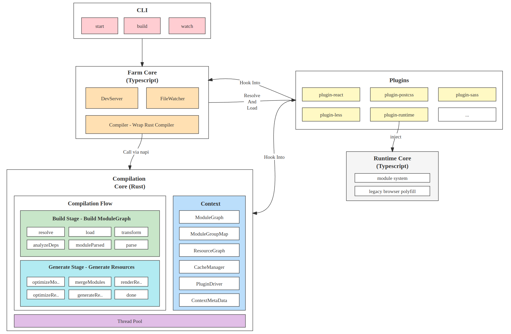

- Name: Farm Core Architecture Design
- Start Date: 2022-07-18
- RFC PR: [farm-fe/rfcs#3](https://github.com/farm-fe/rfcs/pull/3)

# Summary
This is an RFC to design how to implement a super fast web compiler with Typescript and Rust. The new designed compiler should inherit all advantages of existing tools like webpack and vite, but avoid their disadvantages and extremely faster.

# Motivation
As the web project scales, building performance has been the major bottleneck, a web project compilation using webpack may cost 10min or more, a hmr update may cost 10s or more, heavily reduced the efficiency.

So some tools like vite came out, but vite is using native esm and unbundled in dev mode, the huge numbers of module requests becomes the new bottleneck, it may crash the network panel when there are thousands of module requests.

And vite is so fast as it uses esbuild which is written in go, which takes performance advantages of the native. But esm is not available for legacy browsers and esbuild is not strong enough to be used in production for now, so vite uses rollup as bundler in production to solve compatibility issue and esbuild stabilization issue, which brings new problems, for example, the dev and prod's behavior maybe greatly different, and rollup is greatly slower than esbuild as it's written in Typescript.

Actually we can take advantages of both webpack and vite, and avoid all of their disadvantages. Webpack is slow, we can use system level language (Rust) to greatly improve building performance; Vite is unbundled which means the caching can be finer than webpack, but it has problems like inconsistency(dev and prod) and huge requests(may slow down resource loading even crash browser), we can use some module merging strategy to reduce the request numbers without losing cache granularity.

As we discussed above, Farm is a web building tool aim to be faster(both building performance and resources loading performance) and more consistent, take advantages of existing tools and discard their disadvantages. Farm team will focus on web project compiling at present, which means our inputs are mainly web assets html, js/jsx/ts/tsx, css/scss/less, png/svg/... and so on, and every design we made will be browser first. Though universal bundler(bundle everything together and output various format) is not our first goal currently, you can achieve whatever you want by plugins.

Our goal is to design a real modern web compiler which is super fast, stable, consistent, compatible, and modern web tech first. What we want is the true next generation building tool.

> Note: this RFC mainly covers the architecture, the details of each part will be split to a separate RFC.

# Guide-level explanation
This section provides a user level view of Farm.

Farm will be divided into two parts:
- **Compilation core implemented by Rust**: All the compilation flow like resolving, loading, transforming, parsing and dependencies analyzing are charged by Rust compilation core. The Rust core is not visible to users, it is used privately by Farm's npm packages.
- **CLI and Node API implemented by Typescript**: For the users, they only need to install Farm's npm packages which are written in typescript, then all functionalities are available. The npm packages encapsulate the Rust core and provide CLI and Node API for users.

All performance sensitive actions will be implemented in Rust, and others will be implemented in typescript. Using typescript because farm can easily share js community, for example dev-server middleware. And the users should only care about the npm packages.

Farm npm packages is designed to provide two kind of usages: CLI or Node Api, CLI is provided by the farm team to use farm easily; Node Api is provided for the advanced developers who want to build tools on top of Farm.

## 1. CLI Usage
Two kind of official cli provided: `create-farm-app` for creating a farm project with official templates and `@farmfe/cli` for starting or building a farm project.

### 1.1 Using `create-farm-app` to create a project

```bash
npx create-farm-app # create a farm project using official templates
npm start # start the project using farm
npm run build # build the project using farm
```
`create-farm-app` will create a react based project at first, more templates and feature selection will be added in the feature.

#### 1.2 Using `@farmfe/cli` to start/build a project
First you need to create a project by yourself, then install the farm project as below:
```bash
npm i -D @farmfe/core @farmfe/cli # install required package into the project
# or `yarn add --dev @farmfe/core @farmfe/cli` if you use yarn
# or `pnpm add -D @farmfe/core @farmfe/cli` if you use pnpm
```

then create a `farm.config.ts` in the project root(where you call npm start), the config looks like:
```ts
import { defineConfig } from '@farmfe/core';

export default defineConfig({
  // shared config
  root: process.cwd(),
  // compilation config
  compilation: {
    input: {
      index: './index.html'
    },
    output: {
      // details will be described later...
    },
    // details will be described later...
  },
  // dev server config
  server: {
    port: 7896
  }
});
```

then run `farm start` at the project root and visit `http://localhost:7896`.

Farm CLI will provide following commands:
* **start**: start a farm project in dev mode, enable hmr and dev server by default.
* **build**: build a farm project in prod mode.
* **watch**: similar to start except `watch` won't launch dev server.
* **preview**: launch a server to preview the built resources.


## 2. Node Api Usage
Farm's Api export internal compiler, middleware, watcher, config handler and server, the developer can build their own tools based on these functionalities.

To use farm's api, first install the `@farmfe/core` npm package:
```bash
npm i -D @farmfe/core # install required package into the project
# or `yarn add --dev @farmfe/core` if you use yarn
# or `pnpm add -D @farmfe/core` if you use pnpm
```

Example usage:

* Using start/build function directly:
```ts
import { start, build, watch } from '@farmfe/core';

// Start a project with a dev server and file watcher. First build the project in dev mode, then the dev server serves compiled resources and the file watcher watches file changes and trigger re-compile
start({ configPath: './custom.config.js' });

// First build the project in develop mode, then watch a project with a file watcher
watch({ configPath: './custom.config.js' });

// Only build a project in production mode
build({ configPath: './custom.config.js' });
```

* Using internal compiler
```ts
// Note that the internal compiler only provide interface to compile or update a project, do not contain functions like Dev Server or HMR, you should use DevServer and Watcher API separately
import { Compiler, resolveUserConfig } from '@farmfe/core';

const userConfig = resolveUserConfig('./custom.config.js');
const compiler = new Compiler(userConfig);
// async compile
await compiler.compile();
// sync compile
compiler.compileSync();
// async update
await compiler.update(['./index.ts']);
// sync update
compiler.updateSync(['./index.ts']);
```

* Using dev server and watcher, you can use both of them, or use only one of them and custom another
```ts
// DevServer should cooperate with compiler, it will read resources from compiler and serve it.
// Note that DevServer also contains hmr and web socket or lazy compilation middleware if hmr or lazyCompilation is enabled but does not contains file watcher.
import { Compiler, DevServer, FileWatcher } from '@farmfe/core'

// ...
const compiler = new Compiler(config);
const devServer = new DevServer(compiler, config);
const fileWatcher = new FileWatcher(compiler, config);

// compiling
await compiler.compile();
// watching file system and trigger compiler.update()
await fileWatcher.watch();
// listening the specified port
await devServer.listen();
```

# Reference-level explanation
This section covers the technical design details of Farm.

## 1. Design Philosophy
* **Performance first**: Everything will be written in rust as long as we can, only several parts  which is not the performance bottleneck will be written in JS
* **Rollup style plugin system**: Easy to create your own plugins and easy to migrate your plugins/projects from rollup/vite/webpack. 
* **first class citizen support of all web assets**: We won't need to transform everything to Javascript any more, we treat anything as first class citizen, in the farm core basic asset like `html`, `js/jsx/ts/tsx`, `css/scss`, `png/svg/...` will be support by default, you can using plugins to support more assets.
* **browser first**: Farm's production aims to run in the browser/nodejs(only for SSR), we won't be a universal bundler and only try our best to improve web performance and efficiency.
* **Unbundled first**: We only merging modules together when the module numbers of size reach our limits, when merging modules we will use a powerful merging strategy to control the resources request numbers without losing cache granularity.
* **Consistence first**: We will make sure the development and production exactly the same by default, what you see in development will be the same as what you got in production.
* **Compatibility**: Farm will work with both legacy and modern browser.

## 2. Terms
The definition of terms Farm used:
* **Module**: Basic compilation unit, it may be a file or a virtual module, for example, all kinds of web asset like `js, ts, jsx, tsx, css, scss, png, svg...`, or virtual modules implemented by plugins.
* **Resource**: A final generated farm generated after compilation, it may be a js/css/html/png/svg file and may contain may original modules
* **ModuleGroup**: All static imported modules from an entry will be in the same ModuleGroup.
* **ModuleGraph**: Dependency graph of all resolved modules
* **ResourceGraph**: Dependency graph of all generated resources
* **ModuleBucket**: A collection of modules that will be always together, which means the modules in the same `ModuleBucket` will always in the final `Resource`


## 3. Architecture
Farm core contains two parts:
* Typescript is responsible for config/plugins handling, DevServer and FileWatcher(for HMR)
* Rust core is responsible for the compilation details, including module resolving/loading/parsing and resource optimizing/generating.

See detailed graph below:



The details of each part will be designed in following sections.

## 4. Compilation Context
Compilation Context contains all shared info across the compilation, this section covers the details of CompilationContext.

CompilationContext can be accessed in the plugins through hook params:
```rust
struct MyPlugin {}

impl Plugin for MyPlugin {
  fn name(&self) -> String {
    String::from("MyPlugin")
  }
  // access CompilationContext via param
  fn resolve(&self, param: &PluginResolveHookParam, context: &CompilationContext) -> Result<Option<PluginResolveHookResult>> {
    // ..
  }
}
```

The definition of `CompilationContext` is:
```rust
/// Shared context through the whole compilation.
pub struct CompilationContext {
  pub config: Config,
  pub module_graph: RwLock<ModuleGraph>,
  pub module_group_map: ModuleGroupMap,
  pub plugin_driver: PluginDriver,
  pub resource_graph: ResourceGraph,
  pub cache_manager: CacheManager,
  pub meta: ContextMetaData,
}
```
`meta` is shared data through the compilation, for example, SourceMap of Swc. Plugins can also custom data and insert it into `meta.custom`.

Other data structures like module_graph or resource_graph are constructed during the compilation lifecycle of the Farm core.

The details of each field of `CompilationContext` will be introduced in a separate RFC, for example, `ModuleGraph` and `ModuleGroupMap` are related to `module merging algorithm` and `CacheManager` is related to `cache system`. We only cover its goal in this RFC.

## 5. Compilation Flow And Plugin Hooks
The compilation flow is all about hooks, see the graph below for details:

TODO: need hook flows here

We divide the compilation flow into two stages(which we borrowed from rollup) - Build Stage and Generate Stage.

### 5.1 Build Stage
The goal of `Build Stage` is to build a `ModuleGraph`.

Starting from the user configured compilation entry, resolving, loading, transforming and parsing the entry module, then analyze its dependencies and do the same operation for the dependencies again util all related modules handled.

Each module's building flow as flow.
```txt
./index.html -> resolve -> load -> transform -> parse -> moduleParsed -> analyzeDeps
```

Each module will build in a separate thread in a thread pool, and after `analyzeDeps` we back to resolve again of each dependency...

Detailed module building steps as flow:
1. Resolving all entries in `config.input` in parallel, using `config.root` as `importer`, return each entry's `resolved path` and properties(like side effects, external and so on). If `external` is true, throw an error, cause the entry can not be excluded. And the entry is always treated as `side effects` no matter what the resolve returns (we will discuss the details in the tree shaking RFC).
2. 

TODO: hooks details here

### 5.2 Generate Stage

## 6. Plugin System
We have designed all hooks in last section, this section we'll discuss how to register, load and execute Farm's plugin.

## 7. Cache System
> We only introduce our goal of the cache system here, we will design the details in a separate RFC.

## 8. Module Merging And Resource Generation
> We only introduce our goal of the module merging strategy here, we will design the details in a separate RFC.


