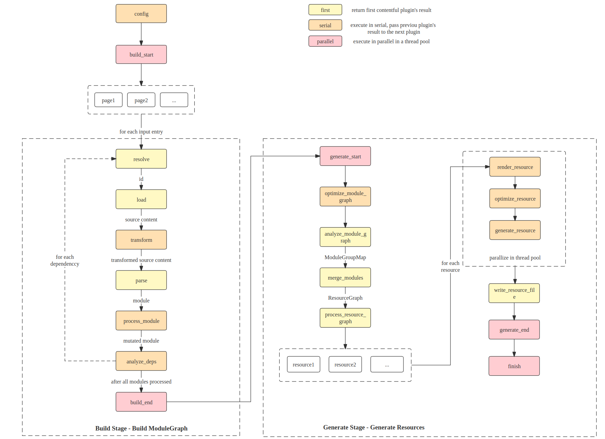

- 主题: Farm 核心架构设计
- 开始时间: 2022-07-18
- RFC PR: [farm-fe/rfcs#3](https://github.com/farm-fe/rfcs/pull/3)

# 总结

本 RFC 设计使用 Typescript 和 Rust 实现极速的 Web 编译器。该编译器设计继承现有工具（如 webpack 和 vite）的优点，同时避免它们的缺点，并且显著提高性能。

# 动机

随着 web 项目的复杂度以及规模的不断增加, 构建性能成为了 web 开发中的一个重要的瓶颈, 使用 webpack 构建的 web 项目可能需要十分钟甚至更长时间, 并且 (HMR) 的更新的时间可能花费数十秒甚至更长时间, 降低了开发效率, 这对于开发体验来说是不可接受的。

然后就出现了像 (vite, snowpack) 的工具来解决这个问题, vite 采用原生 ESM 和 unbundled 解决开发模式的问题, 这样就可以避免 webpack 的构建过程中的大量的 IO 操作。但是缺点是原生 ESM 模块以及动态加载模块, 导致大量开发模块的请求成为了新的瓶颈, 当你有数千个模块的请求时, 可能会导致网络面板崩溃

Vite 的速度非常快, 是因为使用了由 Go 编写的 Esbuild, 能够利用原生的性能优势。然而，Esm 并不支持旧版浏览器，而且 esbuild 目前还不够稳定，不适合在生产中使用。因此，在生产环境中 vite 使用 Rollup 作为打包工具来解决兼容性和稳定性问题。这引入了新的问题，例如开发和生产环境之间行为差异显著，并且 Rollup 和 Esbuild 相比性能较慢。

我们可以充分利用 webpack 和 vite 的优势，同时避免它们的缺点。Webpack 虽然慢，但是我们可以使用系统级语言（Rust）来显著提高构建性能。Vite 的 unbundled 的, 这意味着缓存比 webpack 更加细致 颗粒度更高，但它存在一些问题，如开发和生产之间的不一致性, 以及大量请求（可能会减慢资源加载甚至导致浏览器崩溃）。那么我们可以采用部分打包策略来减少请求数量而不失去缓存粒度。

综上所述, Farm 是一个更快（无论是构建性能还是资源加载性能）和更一致的 Web 构建工具，利用现有工具的优势并且摒弃他们的不足。 Farm 团队最初将专注于 Web 项目编译，这意味着我们的输入主要是 Web 资产，例如 HTML、JS/JSX/TS/TSX、CSS/SCSS/LESS、PNG/SVG 等。我们做出的每一个设计决策都将优先考虑浏览器兼容性。尽管通用打包程序（将所有内容捆绑在一起并输出各种格式）目前不是我们的主要目标，但您依然可以通过插件实现任何想要达到的效果。

我们的目标是设计一个真正现代化的 Web 编译器，它不仅要性能极致，还要稳定、一致、兼容，并且优先考虑现代 Web 技术。我们希望创建一个下一代的构建工具，真正满足开发者的需求。

> 注意：本 RFC 主要涵盖核心架构设计, 后续每个部分的详细信息将拆分为单独的 RFC。

# 参考

该 RFC 涵盖 Farm 的核心架构设计

## 1. 设计理念

- **性能优先**: 我们的目标是所有都用 Rust 编写, 只有极少数或者不是性能瓶颈的部分才会使用 js。
- **Rollup 风格的插件系统**: 以类似 Rollup 的方式设计插件系统, 使得插件可以更加灵活并且更加简便的使用, 并且易于从 Rollup/Vite/Webpack 迁移您的插件/项目。
- **对所有 Web 资源提供支持**: 我们不在需要把所有内容都转换到 javascript, 我们将把任何东西视为一等公民, 在 Farm 中, 默认支持基本资源(如 `html`、`js/jsx/ts/tsx`、`css/scss`、`png/svg/...`)，您可以使用插件来支持更多资源。
- **浏览器优先**: Farm 的目标是在浏览器或者 nodejs 中运行(仅用于 SSR), 专注提高在 Web 的性能和效率。
- **首选非捆绑的方式**: 当模块数量或大小达到限制时，我们只会构建部分模块。在部分捆绑模块时，我们将使用强大的部分捆绑策略来控制资源请求数量，而不会失去缓存的细致度。
- **始终保持一致性**: 开发环境和生产环境产物完全相同。您在开发中看到的内容将与生产中获得的内容相同。
- **兼容性**: Farm 将适用于传统和现代浏览器。

## 2. 术语定义

Farm 使用的术语定义如下:

- **模块(Module)**：基本编译单元，可以是文件或虚拟模块。例如各种 Web 资源，如`js、ts、jsx、tsx、css、scss、png、svg...`，或者是由插件实现的虚拟模块。

- **资源(Resource)**：表示一个 `js/css/html/png/svg/map/..` 文件，并可能包含多个原始模块。

- **资源池(ResourcePot)**：可以生成一个或多个 `Resource`。 `ResourcePot` 可能是一些部分打包的 `Module`, 例如将许多 `js` 模块捆绑到一个 `ResourcePot`, 并且一个 ResourcePot 会生成 `.js` 文件和 `.js.map` 文件。

- **模块组(ModuleGroup)**: 所有从入口静态导入的模块都在同一 `ModuleGroup` 中。

- **模块依赖图(ModuleGraph)**：所有已解析模块的依赖关系图。

- **资源池关系依赖图(ResourcePotGraph)**：'ResourcePot' 的依赖关系图.

- **模块池(Module Pot)**: 'Module Pot' 是一组总是在一起的 module, 这意味着相同 'Module Pot' 中的 modules 将始终位于相同 'Resource Pot'.

## 3. 架构

Farm 核心由两部分组成：

- Typescript 负责处理配置/插件、开发服务器 和文件监视器（用于 HMR）。

- Rust core 负责编译核心部分细节，包括模块解析/加载/解析和资源优化/生成。

请参见下面的详细图表：


每个部分的详细信息将在以下章节中设计。

## 4. 编译上下文

编译上下文包含了整个编译过程中的所有共享信息。本小节将详细介绍编译上下文 `CompilationContext`。

插件可以通过钩子参数访问 `CompilationContext`：

```rust
struct MyPlugin {}

impl Plugin for MyPlugin {
  fn name(&self) -> String {
    String::from("MyPlugin")
  }
  // access CompilationContext via parameter
  fn resolve(&self, param: &PluginResolveHookParam, context: &Arc<CompilationContext>) -> Result<Option<PluginResolveHookResult>> {
    // ..
  }
}
```

`CompilationContext` 的定义如下:

```rust
/// Shared context throughout the whole compilation.
pub struct CompilationContext {
  pub config: Config,
  pub module_graph: RwLock<ModuleGraph>,
  pub module_group_map: ModuleGroupMap,
  pub plugin_driver: PluginDriver,
  pub resource_graph: ResourceGraph,
  pub cache_manager: CacheManager,
  pub meta: ContextMetaData,
}
```

`meta`是编译过程中共享的数据，例如 `swc` 的 `SourceMap`。插件还可以添加自定义数据并将其插入到`meta.custom`中。

对于其他数据结构，如`module_graph`或者`resource_graph`, 是在 Farm 核心的编译生命周期内构建的。

关于 `CompilationContext` 的每个字段的详细信息将在单独的 RFC 中介绍。例如， `ModuleGraph` 和 `ModuleGroupMap` 与 `partial bundling algorithm` 关联, `CacheManager` 与缓存系统关联。

## 5. 编译流程和插件钩子

我们将编译流程(借鉴于 Rollup)分为了两个阶段 - 构建阶段和生成构建产物阶段, 所有编辑流程都是基于 hooks 完成的, 详见下图



有三种类型的钩子（与 Rollup 相同）：

- `first`: 这些钩子按顺序执行，并在某个钩子返回一个“非空”值时立即返回。( null 表示 JS 中的 null 和 undefined，“None” 表示 Rust)

- `serial`: 这些钩子按顺序执行，每个钩子的结果将传递给下一个钩子，使用最后一个 hook 结果作为最终结果。

- `parallel`: 这些 hook 在线程池中并行执行，并应该被隔离。

接下来我们来介绍一下这两个阶段

### 5.1 构建阶段

`构建阶段的目标是构建一个模块依赖图（ModuleGraph）`。
从用户配置的编译入口开始，解析、加载、转换、解析入口模块，然后分析其依赖关系，并对依赖项进行相同的操作，直到处理完所有相关模块。

每个模块的构建流程如下所示。
`./index.html -> 解析（resolve）-> 加载（load）-> 转换（transform）-> 解析（parse）-> 模块解析完毕（moduleParsed）-> 分析依赖（analyzeDeps）----> 递归解析依赖（resolve deps recursively）`

每个模块将在线程池中的一个单独线程中构建，在完成analyzeDeps之后，我们会再次返回到解析（resolve）阶段，为每个依赖项进行处理。

#### 5.1.1 Resolve

resolve 钩子负责模块解析, 返回当前模块的 id 以及其他的相关属性, 请参阅以下钩子定义, 参数 结果如下

- **`Hook Kind`**: `first`

```rust
fn resolve(
  &self,
  _param: &PluginResolveHookParam,
  _context: &Arc<CompilationContext>,
  _hook_context: &PluginHookContext,
) -> Result<Option<PluginResolveHookResult>> {
  // ...
}

/// Parameter of the resolve hook
#[derive(Debug, Clone, Serialize, Deserialize)]
#[serde(rename = "camelCase")]
pub struct PluginResolveHookParam {
  /// the source would like to resolve, for example, './index'
  pub source: String,
  /// the start location to resolve `specifier`, being [None] if resolving an entry or resolving an HMR update.
  pub importer: Option<ModuleId>,
  /// for example, [ResolveKind::Import] for static import (`import a from './a'`)
  pub kind: ResolveKind,
}

#[derive(Debug, Default, Serialize, Deserialize)]
#[serde(rename = "camelCase", default)]
pub struct PluginResolveHookResult {
  /// resolved path, normally a resolved path.
  pub resolved_path: String,
  /// whether this module should be external, if true, the module won't be present in the final result
  pub external: bool,
  /// whether this module has side effects, affects tree shaking
  pub side_effects: bool,
  /// the query parsed from specifier, for example, query should be `{ inline: true }` if specifier is `./a.png?inline`
  /// if you have custom plugins, your plugin should be responsible for parsing the query
  /// if you just want a normal query parsing like the example above, [farmfe_toolkit::resolve::parse_query] should be helpful
  pub query: HashMap<String, String>,
}
```

#### 5.1.2 Load

根据 `id` 加载模块的内容, 返回基于 **String** 的内容, 如果加载类似像图片这样的二进制内容, 则应该首先将其编码为 **base64** 字符串, Farm 强制使用字符串, 因为使用序列化可以更好的把值传递到 JS 插件和 Rust 插件中。

- **`Hook Kind`**: `first`

```rust
fn load(
  &self,
  _param: &PluginLoadHookParam,
  _context: &Arc<CompilationContext>,
  _hook_context: &PluginHookContext,
) -> Result<Option<PluginLoadHookResult>> {
  // ..
}

#[derive(Debug, Clone, Serialize, Deserialize)]
#[serde(rename = "camelCase")]
pub struct PluginLoadHookParam<'a> {
  /// the resolved path from resolve hook
  pub resolved_path: &'a str,
  /// the query map
  pub query: HashMap<String, String>,
}

#[derive(Debug, Serialize, Deserialize)]
#[serde(rename = "camelCase")]
pub struct PluginLoadHookResult {
  /// the source content of the module
  pub content: String,
  /// the type of the module, for example [ModuleType::Js] stands for a normal JavaScript file,
  /// usually ending with `.js` extension
  pub module_type: ModuleType,
}
```

#### 5.1.3 Transform

根据在 Load 中转换出来的模块内容, 转换为字符串输入和字符串输出, 如果您想要共享 Farm 中的内部 `AST` 可以使用 `SWC` 插件

```rust
fn transform(
  &self,
  _param: &PluginTransformHookParam,
  _context: &Arc<CompilationContext>,
) -> Result<Option<PluginTransformHookResult>> {
  // ..
}

#[derive(Debug, Clone, Serialize, Deserialize)]
#[serde(rename = "camelCase")]
pub struct PluginTransformHookParam<'a> {
  /// source content after load or transformed result of the previous plugin
  pub content: String,
  /// module type after load
  pub module_type: ModuleType,
  /// resolved path from resolve hook
  pub resolved_path: &'a str,
  /// query from resolve hook
  pub query: HashMap<String, String>,
}

#[derive(Debug, Default, Serialize, Deserialize)]
#[serde(rename = "camelCase", default)]
pub struct PluginTransformHookResult {
  /// transformed source content, will be passed to the next plugin.
  pub content: String,
  /// you can change the module type after transform.
  pub module_type: Option<ModuleType>,
  /// transformed source map, all plugins' transformed source map will be stored as a source map chain.
  pub source_map: Option<String>,
}
```

#### 5.1.4 Parse

将模块的内容解析为内部“Module”实例，将源代码转换为 AST。

- **`Hook Kind`**: `first`

```rust
fn parse(
  &self,
  _param: &PluginParseHookParam,
  _context: &Arc<CompilationContext>,
  _hook_context: &PluginHookContext,
) -> Result<Option<ModuleMetaData>> {
  // ..
}

#[derive(Debug)]
pub struct PluginParseHookParam {
  /// module id
  pub module_id: ModuleId,
  /// resolved path
  pub resolved_path: String,
  /// resolved query
  pub query: HashMap<String, String>,
  pub module_type: ModuleType,
  /// source content(after transform)
  pub content: String,
}
```

#### 5.1.5 Process Module

流程模块的作用是处理和转换模块, 可能会更改模块的任何属性，例如，转换解析后的 AST(使用 SWC 转换器和 SWC 插件)。

- **`Hook Kind`**: `serial`

```rust
fn process_module(
  &self,
  _module: &mut PluginProcessModuleHookParam,
  _context: &Arc<CompilationContext>,
) -> Result<Option<()>> {
  // ..
}

pub struct PluginProcessModuleHookParam<'a> {
  pub module_id: &'a ModuleId,
  pub module_type: &'a ModuleType,
  pub meta: &'a mut ModuleMetaData,
}
```

#### 5.1.6 Analyze Deps

分析每个模块之间的依赖关系, 例如，`import a from './a'`, 转换之后的结果应该是 `{ specifier: './a', kind: ResolveKind::Import }`

- **`Hook Kind`**: `serial`

```rust
fn analyze_deps(
  &self,
  _param: &mut PluginAnalyzeDepsHookParam,
  _context: &Arc<CompilationContext>,
) -> Result<Option<()>> {
  // ..
}

pub struct PluginAnalyzeDepsHookParam<'a> {
  pub module: &'a Module,
  /// analyzed deps from previous plugins, if you want to analyze more deps, you must push new entries to it.
  pub deps: Vec<PluginAnalyzeDepsHookResultEntry>,
}

#[derive(Debug, Clone, Serialize, Deserialize)]
#[serde(rename = "camelCase")]
pub struct PluginAnalyzeDepsHookResultEntry {
  /// the source would like to resolve, for example, './index'
  pub source: String,
  /// the start location to resolve `specifier`, being [None] if resolving an entry or resolving an HMR update.
  pub importer: Option<ModuleId>,
  /// for example, [ResolveKind::Import] for static import (`import a from './a'`)
  pub kind: ResolveKind,
}
```

### 5.2 生成阶段

生成阶段的目标是尽可能高效地生成可部署资源（如 js、html、css、wasm）等其他资源。

流程如下:

`ModuleGraph generated in build stage ---> optimize_module_graph -> analyze_module_graph -> partial bundle module -> process_resource_graph ---> for each resource in parallel ---> render_resource -> optimize_resource -> generate_resource_file -> write_resource_file`

每类钩子代码如下:

```rust
/// Some optimization of the module graph should be performed here, for example, tree shaking, scope hoisting
  fn optimize_module_graph(
    &self,
    _module_graph: &RwLock<ModuleGraph>,
    _context: &Arc<CompilationContext>,
  ) -> Result<Option<()>> {
    Ok(None)
  }

  /// Analyze module group based on module graph
  fn analyze_module_graph(
    &self,
    _module_graph: &RwLock<ModuleGraph>,
    _context: &Arc<CompilationContext>,
  ) -> Result<Option<ModuleGroupMap>> {
    Ok(None)
  }

  /// Partial Bundling modules of the module group map to [crate::resource::resource_graph::ResourceGraph]
  fn partial_bundle_modules(
    &self,
    _module_group: &ModuleGroupMap,
    _context: &Arc<CompilationContext>,
  ) -> Result<Option<ResourceGraph>> {
    Ok(None)
  }

  /// process resource graph before render and generating each resource
  fn process_resource_graph(
    &self,
    _resource_graph: &RwLock<ResourceGraph>,
    _context: &Arc<CompilationContext>,
  ) -> Result<Option<()>> {
    Ok(None)
  }

  /// Render the [Resource] in [ResourceGraph].
  /// May merge the module's ast in the same resource to a single ast and transform the output format to custom module system and ESM
  fn render_resource(
    &self,
    _resource: &mut Resource,
    _context: &Arc<CompilationContext>,
  ) -> Result<Option<()>> {
    Ok(None)
  }

  /// Optimize the final resource, for example, minimize every resource in the resource graph
  fn optimize_resource(
    &self,
    _resource: &mut Resource,
    _context: &Arc<CompilationContext>,
  ) -> Result<Option<()>> {
    Ok(None)
  }

  /// Generate resources based on the [ResourceGraph]
  /// This hook is executed in serial and should update the content inside ResourceGraph
  fn generate_resource(
    &self,
    _resource_graph: &mut Resource,
    _context: &Arc<CompilationContext>,
  ) -> Result<Option<()>> {
    Ok(None)
  }

  /// Write the final output [Resource] to disk or not
  fn write_resource_file(
    &self,
    _resource: &Resource,
    _context: &Arc<CompilationContext>,
  ) -> Result<Option<()>> {
    Ok(None)
  }
```

### 6. 插件系统

在本节中，我们将讨论如何注册、加载和执行 Farm 的插件。

Farm 计划支持两种类型的插件：

- **Rust 插件**：使用 Rust 编写并作为动态库分发，提供最佳性能和实现所有编译钩子的能力。这是编写插件的推荐方式。

- **JS 插件**：使用 JavaScript（TypeScript）编写并作为 Node.js 可执行脚本文件分发。它会减慢编译过程，并且只能实现有限的钩子。Farm 支持 JS 插件，因为它想要共享已经用 JS/TS 编写的社区工具，例如很多 Web 工具（比如 less）目前还没有 Rust 版本。

### 6.1 Rust Plugin

Rust 插件是 Farm 插件的主要方向, 因为它们快速并且强大, 但是当我们遇到 Rust 生态系统无法提供的功能时, JS 插件将成为备选方案。

我们使用`动态库`(MacOS 上的`.dylib`，Windows 上的`.dll`，Linux 上的`.so`) 来作为分发 Rust 插件的方式，因为这是性能最好的方式。我们研究了许多方法，但没有一种方法适合：

- **abi_stable**: 支持 FFI 安全调用的 Rust 库，但我们必须使用它的原语 STD 类型(如`RString`替换 STD`String`)，这些类型不是 rkyv 可序列化的(支持 Persistent Cache 需要序列化)。如果我们必须同时支持这两个问题，我们将面临一段艰难的时期。

- **wasm**: 这是 SWC 目前使用的模式。Wasm 的优点在于它们具有可移植性和高性能。然而，Wasm 运行时不能与 Rust 共享内存，因此我们需要将其序列化并复制到 Wasm 运行时，并在插件执行后将其复制回 Rust 并进行反序列化。这些钩子可能会被调用数千次，效率非常低下。此外，Wasm 插件不支持并行处理，在确保线程之间 CompilationContext 一致性方面存在困难，特别是当我们需要对其进行序列化/反序列化时。

所以我们决定选择动态库的模式来支持 Rust Plugins。我们加载动态库，并将其作为内部插件执行，因此可以避免上面提到的许多问题：

- **最佳性能**：动态库插件的执行速度和内部插件一样快，因为我们可以共享内存和完全并行。
- **单一类型**：不需要为动态库插件提供额外类型。

然而，有一些问题需要我们解决:

- **跨平台分发**：动态库插件不可移植，需要针对不同平台单独搭建。当在一台机器上构建时，它需要交叉编译。

- **共享类型内存布局**：我们与动态库插件的内部插件共享相同的类型，但如果类型发生变化，插件也需要重新构建，因为它们的内存布局发生了变化。如果插件没有重新构建，则会抛出`分段错误`。

我们解决上述问题的方法如下：

- **提供可移植的交叉编译工具**：我们将提供独立的插件构建和发布工具。插件作者只需要使用`Farm Plugin`进行构建，Farm 就会处理所有的细节。

- **尽量减少共享类型，确保其稳定**：我们只将必要的类型暴露给插件，而可变部分将类似于 `Custom(Box<dyn any>)`，所以类型稳定后很少发生变化。我们还记录当前类型的版本，如果我们确实需要更改类型，我们会升级类型模式版本，并通知用户升级他们的遗留插件。

### 6.2 JS 插件

我们对 JS 的插件支持比较有限, 导致目前 JS 插件只能实现`build_start`、`resolve`、`load`、`transform`、`build_end`和`finish`钩子。由于 Rust 和 JS 之间的数据转换代价很高，如果我们将所有像 ModuleGraph 这样的数据发送到 JS 端，将显著减慢编译速度，这违背了我们的意愿。

并且 JS 插件也应该指定`filters`字段，以指定它愿意处理哪个模块。出于性能原因，我们也添加了此限制。

```js
export default {
  name: 'js-plugin', // plugin name
  priority: 10, // priority, controls the execute order of plugins
  resolve: {
    // specify the target modules this plugin wants to process
    filters: {
      importers: [],
      specifiers: ['from_js_plugin'],
    },
    // hook callback
    executor: async (param, context) => {
      console.log(param, context);

      if (!param.caller) {
        const resolved = await context.resolve({
          ...param,
          specifier: './from_js_plugin',
          caller: 'js-plugin',
        });
        console.log('call internal resolve in js', resolved);
        resolved.id += '.js-plugin';
        return resolved;
      }
    },
  },
},
```

## 7. 缓存系统

> 我们在这里只介绍作为缓存系统最终实现的目标，我们将在单独的 RFC 中设计细节。

`缓存系统`的目的是提供一个跨整个编译流程的通用缓存，这意味着：

- 包含 HMR 缓存，HMR 进程只更新模块图和最终资源中的一些必要模块，而其他模块在命中缓存时将保持不变。

- 包含 `编译流` 缓存，即一个模块只处理一次。
- 覆盖 `磁盘` 缓存，即可以将缓存串行化到磁盘并从磁盘恢复，提供类似 Webpack5 中持久缓存的能力。

借助缓存系统，服务器场可以为 HMR 提供极快的体验，并通过缓存实现热启动。

缓存能力在`CacheManager`中设计，我们将在单独的 RFC 中介绍详细内容。

## 8. 部分捆绑构建和资源生成

> 我们在这里只介绍我们的部分捆绑策略的目标，我们将在单独的 RFC 中设计细节。

Farm 使用 `Partial Bundling` 而不是 `Bundling`，因为我们首先是`Unbundled`。仅当模块的请求数量超过请求数量限制时，Farm 才会将模块合并在一起。我们已经做了很多测试，结果表明，在现代浏览器中，20-30 个请求将是性能最高的。当有数千个模块时，我们将使用优化策略将数千个模块合并为 20-30 个资源。

对于部分捆绑策略，Farm 将确保：

- 所有共享模块和动态模块将尽可能位于单独的资源中。这类似于传统捆绑包中的代码拆分，但我们将更精确地控制每个资源中的模块。

- 相关模块会尽可能放在同一资源中，例如，同一目录下的模块，因为开发人员通常会将所有相关资源放在一起，所以它们更具关联性。

此外，开发人员还可以自己配置哪些模块应该合并在一起。我们将在单独的 RFC 中介绍细节。

## 9. 用户界面设计

Farm 的设计被分为两个部分

- **Rust 实现的编译核心**：所有的解析、加载、转换、解析、依赖分析、代码优化/生成等编译流程都由 Rust 负责。Rust 部分对用户不可见，它由 Farm 的 NPM 包私下使用。只有几个 API 是从内核为 Rust 插件导出的。

- **通过 TypeScrip 实现的 CLI 和 Node API**：对于用户来说，只需要安装 Farm 的 npm 包，这些 npm 包是用 TypeScrip 编写的，就可以使用所有功能了。NPM 包封装了 Rust 内核，为用户提供了 CLI 和 Node API。所有插件也都是以 npm 包的形式分发的。

所有对性能敏感的操作都将在 Rust 中实现，其他对性能要求较低的操作或者 Rust 生态系统比较薄弱的部分将在 TypeScrip 中实现。使用 TypeScript 是因为 Farm 可以轻松地共享 js 社区，例如开发服务器中间件和转换器(less、markdown 等)。用户应该只关心 npm 包。

Farm 中的 npm 包旨在提供两种用法：CLI 或 Node Api，CLI 由 Farm 团队提供以方便通过命令行的方式来快速使用 Farm 的核心功能，Node Api 是为想要在 Farm 之上构建工具的高级开发人员提供的。

## 1. CLI 的使用方式

提供了两种官方 cli：`create-farm`，用于使用官方模板创建基于 Farm 的各种框架项目；`@farmfe/cli`，用于启动或建设 Farm 或者插件项目。

### 1.1 使用 `create-farm` 来创建项目

```bash
npx create-farm # create a farm project using official templates
npm start # start the project using farm
npm run build # build the project using farm
```

`create-farm`目前支持 Vue 和 React 项目，后续会添加更多模板和功能选择。

# 1.2 使用`@farmfe/cli`启动/搭建项目。

首先，您需要自己创建一个项目，然后安装场项目，如下所示：

```bash
npm i -D @farmfe/core @farmfe/cli # install required packages into the project
# or `yarn add --dev @farmfe/core @farmfe/cli` if you use yarn
# or `pnpm add -D @farmfe/core @farmfe/cli` if you use pnpm
```

接下来，在工程根目录中创建一个`farm.config.ts`，配置如下：

```ts
import { defineConfig } from "@farmfe/core";

export default defineConfig({
  // shared config
  root: process.cwd(),
  // compilation config
  compilation: {
    input: {
      index: "./index.html",
    },
    output: {
      // details will be described later...
    },
  },
  // dev server config
  server: {
    port: 7896,
  },
});
```

最后，在项目根目录下运行`npx farm start`并访问`http://localhost:7896`.

Farm 的 CLI 将提供以下命令：

- **start**：在 dev 模式下启动一个场项目，默认开启 HMR 和 dev 服务器。
- **build**：以 Prod 模式构建场项目。
- **watch**：与启动类似，不同的是`watch`不会启动开发服务器。
- **preview**：启动服务器预览已构建的资源。

## 2. Node API 使用方式

Farm 的 API 导出内部编译器、中间件、监视器、配置处理程序和服务器，允许开发人员基于这些功能构建自己的工具。

要使用 Farm 的 API，首先需要安装`@farmfe/core` 的 npm 包：

```bash
npm i -D @farmfe/core # install required package into the project
# or `yarn add --dev @farmfe/core` if you use yarn
# or `pnpm add -D @farmfe/core` if you use pnpm
```

用法示例：

- 直接使用 Start/Build 功能：

```ts
import { start, build, watch } from "@farmfe/core";

// Start a project with a dev server and file watcher. First, build the project in dev mode, then the dev server serves compiled resources and the file watcher watches file changes and triggers re-compile
start({ configPath: "./custom.config.js" });

// First, build the project in develop mode, then watch a project with a file watcher
watch({ configPath: "./custom.config.js" });

// Only build a project in production mode
build({ configPath: "./custom.config.js" });
```

- 使用内部编译器

```ts
// Note that the internal compiler only provides an interface to compile or update a project, and does not contain functions like Dev Server or HMR. You should use DevServer and Watcher API separately.
import { Compiler, resolveUserConfig } from "@farmfe/core";

const userConfig = resolveUserConfig("./custom.config.js");
const compiler = new Compiler(userConfig);
// async compile
await compiler.compile();
// sync compile
compiler.compileSync();
// async update
await compiler.update(["./index.ts"]);
// sync update
compiler.updateSync(["./index.ts"]);
```

- 使用 dev 服务器和监视器，您可以同时使用它们，或者只使用其中一个并自定义另一个

```ts
// DevServer should cooperate with the compiler, as it will read resources from the compiler and serve them.
// Note that DevServer also contains HMR and WebSocket or lazy compilation middleware if HMR or lazyCompilation is enabled, but does not contain a file watcher.
import { Compiler, DevServer, FileWatcher } from "@farmfe/core";

// ...
const compiler = new Compiler(config);
const devServer = new DevServer(compiler, config);
const fileWatcher = new FileWatcher(compiler, config);

// compiling
await compiler.compile();
// watching file system and triggering compiler.update()
await fileWatcher.watch();
// listening on the specified port
await devServer.listen();
```
