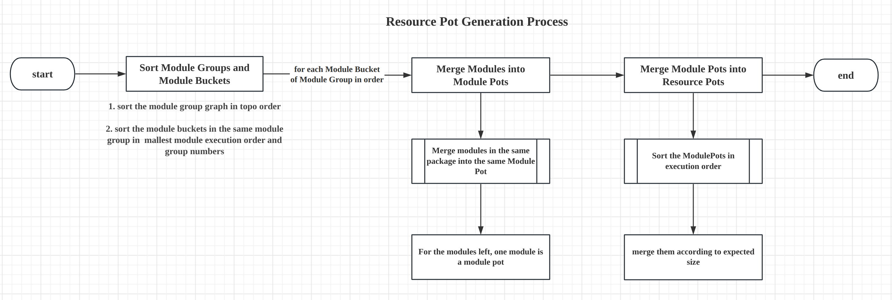

- Name: Farm Partial Bundling
- Start Date: 2023-08-30
- RFC PR: [farm-fe/rfcs#9](https://github.com/farm-fe/rfcs/pull/4)

# Summary
This RFC designs Farm's Partial Bundling strategy, including:
1. What is `Partial Bundling`
2. The Motivation of `Partial Bundling`
3. Internal details of `Partial Bundling`
4. Configurations and real world examples of `Partial Bundling`

# What's Partial Bundling
`Partial Bundling` is a strategy that Farm uses to bundle modules, similar to what other bundlers do but the goal of Farm's `Partial Bundling` is different.

Unlike other bundlers, Farm will not trying to bundle everything together and then split them out using optimizations like `splitChunks`, on the opposite, Farm will bundle projects into several output files directly. For example, if there are hundreds of modules needed to launch a html page, Farm will try to bundle them into 20-30 output files directly. Farm calls this behavior `Partial Bundling`.

Farm's goal of Partial Bundling is to:
1. **Reduce request numbers and request hierarchy**: Make hundreds or thousands of module requests reduce to 20-30 requests, and avoid loading modules one after one due to dependency hierarchy, which would make resource loading faster.
2. **Increase cache hit rate**: When a modules changed, makes sure that only a few output files are affected, so more cache can be used for a online project.

For traditional bundlers, we may have a hard time to configure complex `splitChunks` or `manualChunks` to achieve the goal above, but in Farm, it is supported natively through `Partial Bundling`.

# Motivation
There are two main methods of handling modules in web build tools now: Bundling or native ESM. But they both have drawbacks:
* For bundling, bundlers aim to bundle everything together and then split them out for optimization, but splitting is often hard to configure and is hard to balance resources loading performance and cache hit rate manually. 
* For native esm, every module can be compiled, cached separately, but the load performance are heavily affected when there are hundreds of module requests.

So I was always thinking that if there is a strategy to avoid these two extremes - maybe we can do partial bundling? we can just bundle the project into several limited, size balanced resources directly and automatically. I named this thinking `Module Merging` - Find a balance between bundle and unbundled, only bundles a few related modules to improve loading performance without losing cache granularity.

> I renamed `Module Merging` to `Partial Bundling` later because I think `Partial Bundling` can expresses more accurately what I was thinking.

But some of my friends thought that is what `splitChunks` of webpack does, but I don't think so, they are similar but their basic ideas is different:
* Farm does not always bundle, only if concurrent module requests or request hierarchy exceed Farm's threshold, Farm does partial bundling only when necessary.
* Farm does bundling only for performance reason, if one day hundreds of concurrent ordered requests are acceptable, then Farm will not bundle any more.

And this fundamental difference also greatly affects the design choices when implement bundling. The detailed designs will be described in following sections.

# Design Philosophy
To achieve our two goals(reduce request numbers and increase cache hit rate), some general optimize principles should be respected:
1. The request numbers should be limited and the size of each output resource should be close to.
2. When changing a few modules, the impact on output resources should be as small as possible.

Based on above principles, following rules are designed:

1. **Mutable and immutable modules should always be in different output files**: For example, if we changed our business code, we would not expect that modules under `node_modules` are affected.
2. **Shared modules should be in isolate output files as long as they can**: For modules shared between multiple entries or dynamic imported entries, they should be in separated output file, so we won't loading unnecessary modules when loading these files.
3. **The target concurrent requests for a resource loading should be between 20-30 by default**: After a lots of tests, we found that 20-30 concurrent requests have best performance when loading resources concurrently.
4. **Related modules should be in the same output file as long as they can**: For example, modules under the same package should be together, if the package is updated, then only a few output files are affected.
    * 4.1 Modules under the same package should be in the same output file.
    * 4.2 Closer module in the dependency tree should be more likely in the same output file.
5. **Output files should be of similar size and min resource size should be greater than 20KB by default**: Avoid buckets effect and make concurrent resources loading faster.
6. **The output files are stable**: which means, when new modules or packages are added or removed, the output won't be changed on a large scale, the influence of this addition or remove should be as small as possible.
    * When above size rule conflict with this rule, this rule are preferred, stable output should be ensured first.
7. **When above rules conflict, more requests are preferred by default**: For example, if `minResourceSize` is violated due to `mutable/immutable modules`, `minResourceSize` will be ignored, because one of farm's philosophy is `Unbundled First`, we prefer more granular output files by default. 
    * This default behavior can be configured by `enforceMinResourceSize` and `enforceTargetConcurrentRequests`, but this may cause duplication, no silver bullet here, just tradeoffs.

# Reference-level explanation
This section explains the technical part of Partial Bundling.

## Related Terms That Farm Defines
* **Module**: Basic compilation Unit for Farm, it can be a file loaded for disk or a virtual module generated by plugins.
* **ModuleGraph**: Graph of modules, if a module `imports` another module, then a dependency edge would be created in the graph.
* **ModuleGroup**: All necessary modules for initial execution or dynamic request. For example, all statically imported modules start from `index.ts` or all statically imported modules start from a dynamically imported modules. We'll illustrate it in following sections.
* **ModuleGroupGraph**: Graph of module groups, if any module of module group dynamically imports another module group's entry modules, then a dependency edge would be created in the graph. 
* **ModuleBucket**: Modules which are in the Module Groups. A module can be in many Module Groups, if all the ModuleGroups of two modules are the same, then these two modules are in the same ModuleBucket.
* **ModulePot**: Modules in the same Module Pot would always be in the same output resource. For example, modules in the same package will be in the same ModulePot if there are many packages.
* **ResourcePot**: A Resource Pot consist of one or more Module Pots, and a Resource Pot should produce a `output resource` and a optional `.map` resource.
    * The difference of `ResourcePot` and `Resource` is that `ResourcePot` is a intermediate structure, it contains AST and other property used for rendering. After rendering the `ResourcePot`, `Resources`(like `.js` and `.js.map`) will be produced 
* **Resource**: A Resource is a final output file, like `index.js`, `index.js.map`, `index.css`, `index.html`

## Partial Bundling Process

The partial bundling process is split into 4 steps:
1. Create `ModuleGroupGraph` base on module graph that we created in `Build Stage`.
2. Create `ModuleBuckets` from `ModuleGroupGraph`
3. Create `ModulePots` for each `ModuleBucket` that satisfy our rules fined above.
4. Merge `ModulePots` into `ResourcePot`

we discuss the details of each step in following sections. 

Assume that we already have following `ModuleGraph`:

## Generate Module Groups
A new ModuleGroup is created when one of following conditions are satisfied:
* The entry module starts a new ModuleGroup
* Dynamically imported module starts a new ModuleGroup

A ModuleGroup contains all statically connected modules, so when we need to load entry module or loading dynamically requested modules, we can just load all modules in the ModuleGroup.

ModuleGroups are generated from ModuleGraph like the illustration below:

First, entry ModuleGroup `Group A` and `Group B` are created. `C` are statically imported by `A`, so `C` is also in `Group A`. And `D`, `E` are in `Group B` because `B` statically imports them.

Then traversing the ModuleGraph starting from module `A` and `B`.
Create a new ModuleGroup meeting a new dynamic dependency. `A` dynamically imports `D` so `Group D` is created.

After traversing, `Group E`, `Group G` should be added to ModuleGroups. We can see all the modules and groups in above illustration. Note that a module can be in multiple `Module Group`, for example, `H` are in `Group F/G/B/D`.

After the Groups are generated, we can get following `ModuleGroupGraph` easily by searching dynamic edges:

Once we have this `ModuleGroupGraph`, we can known that if `A` is about to be loaded, then all modules inside `Group A`(A and C) should be loaded. And when `A` tries to dynamically imports `D` then all modules inside `Group D` should be loaded.

## Generate Module Buckets
In above section, we get the `ModuleGroupGraph`, and we can know **which modules** should be grouped together when loading modules. Next we'll discuss how to merge modules in the same ModuleGroup.

Actually we can just bundle every `Module Group` separately and everything will be fine too. However, there are two issues: module duplication and less requests numbers. As we can see, the ModuleGroups can be overlapped and a group only produces one output. More modules need to be loaded and less concurrent requests are made, it isn't performant.

So a general idea flows our mind, can we just merge modules in the group to smaller structures? Of cause, and that's what I named `ModuleBucket`. See the following illustration:

To avoid duplication and only load necessary modules, we can put modules **which have the same ModuleGroups** together. For example, `A`, `C` are in `Group A` and `Group F`, so they are in the same ModuleBucket. and `B`, `E` are in `Group B`, `D` is is `Group B` and `Group D`, so two more ModuleBuckets are created. After processing, 6 ModuleBuckets should be created like above illustration.

ModuleBucket aims to remove duplication between ModuleGroups, different ModuleBucket should produce different files. For example, when `A` tries to dynamically load `D`, then `Group D` should be loaded, and `Group D` contains `D` and `H`. But `H` can be in other group, for example, `Group G`, if `D` and `H` are in the same output file, then `Group G` will load unnecessary extra module `D`. So module `D` and `H` are in different Module Bucket.

But ModuleBucket is not our final target, A ModuleBucket can also contain a lot of modules, then how to merge modules inside the same ModuleBucket is the most important thing of `Partial Bundling`, and it is also what `Partial Bundling` differs from traditional bundling.

## Generate Resource Pots
Now we have arrived the final but most important part: generate resources based on the hard work we have done above. And a Resource Pot is container contains structure of a resource and a optional sourcemap.

> Keep the output `stable` is our most important rules defined above. So when size, requests numbers and stability conflict, `stability` will be given priority.

To satisfy the rules we defined above, I design a intermediate structure called `ModulePot`, A `ModulePot` is a fundamental unit, all modules in the same `ModulePot` are always in the same output file. `ModulePots` can be merged to `ResourcePot` to satisfy our `request numbers limitation`.

Resource Pot Generation Process:

Resource Pot Generation Process is split into 3 steps:
1. **Sort the ModuleGroups and ModuleBuckets**: deal with the module groups in topological order, for each module group, sort the module buckets in execution order.
2. **Merge modules into ModulePots**: Merge related modules together and treat them as basic unit.
3. **Merge ModulePots into ResourcePots**: Merge related modules together.

### Create Module Pots
Module Pots are created based on following rules:
1. Modules in the same immutable package are in the same ModulePot
2. For other modules, on module is a module pot

When we get the ModulePots, we are almost reach the last step: generate resource pot.

### Merge Module Pots into Resource Pot

# User Configurations Design

# Real World Examples
